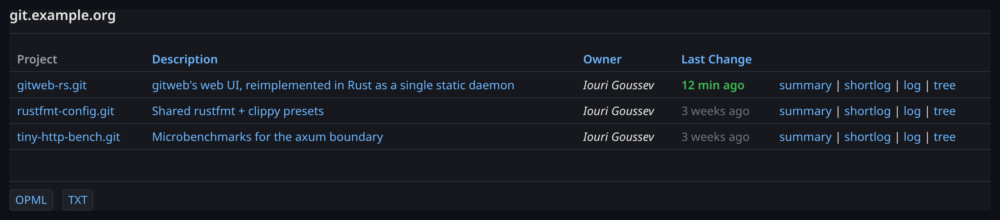
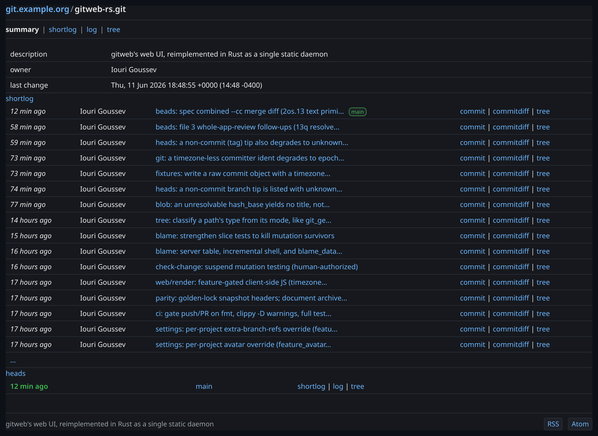
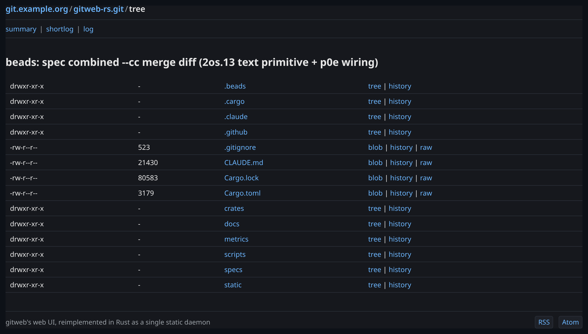
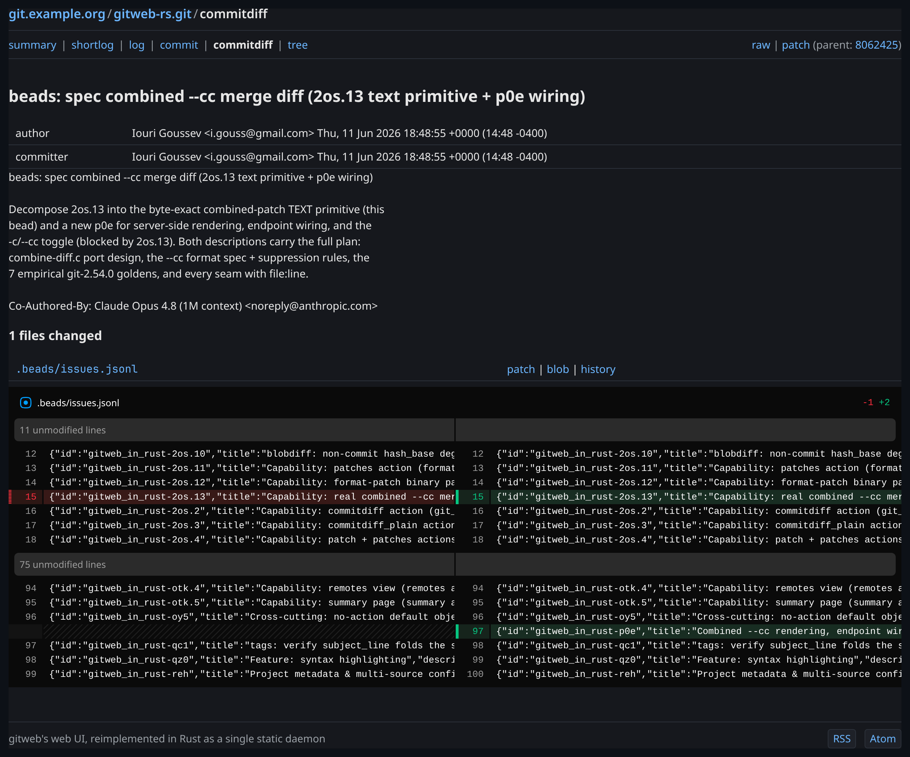

<div align="center">

# gitweb-rs

**git's `gitweb` web interface, rewritten in Rust as a single static daemon — no Perl, no CGI, no `git` binary.**

[](https://github.com/elendal/gitweb_in_rust/actions/workflows/ci.yml)
[](#license)
[](https://www.rust-lang.org)
[](#design-philosophy)
[](https://doc.rust-lang.org/edition-guide/)

```sh
cargo install --git https://github.com/elendal/gitweb_in_rust gitweb-rs
GITWEB_PROJECTROOT=/srv/git gitweb-rs   # → http://127.0.0.1:8080
```

</div>

---

## TL;DR

### The Problem

`gitweb` — the web frontend that ships with git — is **2,800 lines of Perl CGI**. To run it you stand up a web server, wire up CGI or FastCGI, install a working Perl with `CGI.pm` (which Perl core dropped in 5.22), and configure it with an *executable Perl config file* that runs in-process on every request. It works, it's everywhere, and it's a deployment relic from 2006: a forking CGI script with a config surface that is literally arbitrary code execution by design.

### The Solution

`gitweb-rs` reimplements gitweb as a **single statically-linkable Rust binary**. It speaks HTTP directly (axum), reads git repositories with a **pure-Rust git backend** (`gix` — no `git` subprocess), and is configured with a **declarative TOML file** instead of executable Perl. Point it at a directory of repositories and it serves the same URLs, the same actions, and — where it matters — the same bytes.

```sh
GITWEB_PROJECTROOT=/srv/git gitweb-rs
# gitweb-rs: serving on http://127.0.0.1:8080
```

No web server to configure. No Perl. No `git` on `PATH`. One process.

### Why use it?

| | gitweb (Perl CGI) | **gitweb-rs** |
|---|---|---|
| Deployment | web server + CGI/FastCGI + Perl + `CGI.pm` | one static binary |
| git access | forks `git` per request | in-process `gix`, no subprocess |
| Config | executable Perl (`gitweb.conf`) | declarative TOML |
| Process model | fork-per-request CGI | async daemon (tokio), graceful shutdown |
| Memory safety | — | `#![forbid(unsafe_code)]`, workspace-wide |
| Format-stable endpoints | reference | **byte-exact** vs `gitweb.perl` |
| HTML pages | reference | modernized markup, verified behaviourally |
| Diff viewing | server-rendered `<table>` | optional inline JS viewer, graceful fallback |

`gitweb-rs` is a **faithful port, not a reinterpretation**. Its `patch`, `commitdiff_plain`, `blob_plain`, RSS/Atom feeds, OPML, and project-index endpoints are diffed **byte-for-byte against output captured from the real `gitweb.perl`** in CI. Other tools parse those endpoints; they cannot drift.

---

## Screenshots

| Project list | Repository summary |
|:---:|:---:|
| [](docs/screenshots/project-list.png) | [](docs/screenshots/summary.png) |
| **The default page** — every repo under the project root, with owner and relative last-change age. | **`a=summary`** — description, owner, shortlog with ref markers, and the heads list. |

| Tree browser | Commit diff (inline viewer) |
|:---:|:---:|
| [](docs/screenshots/tree.png) | [](docs/screenshots/commitdiff.png) |
| **`a=tree`** — file modes, sizes, and per-entry blob/tree/history/raw links. | **`a=commitdiff`** — commit metadata, message, and a side-by-side diff rendered by the optional inline viewer. |

> The dark theme is the modernized HTML default. Format-stable endpoints (patches, feeds, plain blobs) are unstyled and held byte-exact against `gitweb.perl` — see [Design Philosophy](#design-philosophy).

---

## Quick Example

```sh
# Build and run against a directory full of bare repos
cargo install --git https://github.com/elendal/gitweb_in_rust gitweb-rs
GITWEB_PROJECTROOT=/srv/git gitweb-rs &

# The project list (gitweb's default action)
curl -s http://127.0.0.1:8080/

# A repository summary
curl -s 'http://127.0.0.1:8080/?p=linux.git&a=summary'

# A commit, as a clean unified patch — byte-identical to `git format-patch`
curl -s 'http://127.0.0.1:8080/?p=linux.git&a=patch&h=HEAD'

# The Atom feed, byte-identical to gitweb.perl's
curl -s 'http://127.0.0.1:8080/?p=linux.git&a=atom'

# A tarball snapshot of a ref
curl -sL 'http://127.0.0.1:8080/?p=linux.git&a=snapshot&h=HEAD&sf=tgz' -o linux-HEAD.tar.gz
```

URLs follow gitweb's `?p=<repo>&a=<action>&h=<ref>` query form (plus the `PATH_INFO` form when enabled). One deliberate divergence: parameters are separated by `&` only — gitweb's `CGI.pm` also accepts `;`, gitweb-rs does not. Bookmarks using `&` keep working; rewrite any that use `;`.

---

## Design Philosophy

This project has opinions. They are enforced mechanically, not by good intentions.

1. **Behavioural parity, not vibes.** Every behaviour gitweb has is pinned by an executable spec. The endpoints other programs parse (patches, plain blobs, feeds, OPML, project index) are held **byte-exact** against reference output captured from the actual `gitweb.perl` — see [Architecture](#architecture). HTML pages, which only humans read, are modernized and verified behaviourally instead of frozen byte-for-byte.

2. **Pure Rust, no shelling out.** Repositories are read with `gix`, in-process. There is no `git` subprocess, no `git archive` pipe, no Perl interpreter. The attack surface and the dependency list are both a fraction of the original.

3. **Hexagonal architecture, dependencies point inward.** The domain (git entities, business rules) is framework-free — it knows nothing about axum, `gix`, TOML, or HTML. Adapters on the outside (web, git, config, render) depend on the domain; the domain depends on nothing. This is **mechanically enforced**: every crate declares a `role`, and a lint fails the build on any forbidden cross-role edge.

4. **Spec-first (the `.feature` files *are* the spec).** There is no separate requirements document. Behaviour is described as a Gherkin scenario first, watched to fail, then implemented. **1,546 scenarios across 194 feature files** are the source of truth.

5. **No `unsafe`. Anywhere.** `#![forbid(unsafe_code)]` in every crate, and a CI guard that fails if a new crate is added without it. The compiler enforces it; the guard catches the gap the compiler can't.

---

## Comparison vs Alternatives

| Tool | Language | Deploy | git access | Faithful to gitweb URLs |
|------|----------|--------|------------|--------------------------|
| **gitweb-rs** | Rust | one static binary | in-process `gix` | **yes — byte-exact where it counts** |
| gitweb | Perl | web server + CGI + Perl | forks `git` | reference implementation |
| cgit | C | web server + CGI/FastCGI | libgit2 / `git` | no (own URL scheme) |
| Gitea / Forgejo | Go | full forge (DB, auth, CI) | go-git / `git` | no |
| GitWeb-on-Gitiles | Java | servlet container | JGit | no |

`gitweb-rs` is deliberately **not** a forge. It does one thing: serve a read-only web view of bare git repositories, exactly the way gitweb does, with none of gitweb's runtime baggage. If you want issues, pull requests, and accounts, use a forge. If you have a `projectroot` full of bare repos and you want them on the web with the lowest possible operational cost, this is the tool.

---

## Installation

`gitweb-rs` is **work in progress** and not yet published to crates.io or as a binary release. Install from source.

### From source with cargo (recommended)

```sh
cargo install --git https://github.com/elendal/gitweb_in_rust gitweb-rs
```

The binary is named `gitweb-rs`.

### Clone and build

```sh
git clone https://github.com/elendal/gitweb_in_rust
cd gitweb_in_rust
cargo build --release
./target/release/gitweb-rs
```

Requires a **Rust 1.93+** toolchain (edition 2024). No system dependencies, no Perl, no `git` binary.

### Inline diff viewer (optional)

The inline JavaScript diff viewer is a vendored bundle (`@pierre/diffs`), built once and served as a static asset. It is **not** required — without it the diff view degrades to a plain raw-diff link, and every other route is unaffected.

```sh
# Requires `bun` (https://bun.sh) — only to build the bundle, never at runtime
./scripts/vendor-pierre.sh   # → static/vendor/pierre/
```

---

## Quick Start

1. **Have some bare repositories.** gitweb (and gitweb-rs) serve bare repos out of a `projectroot`:

   ```sh
   mkdir -p /srv/git
   git clone --bare https://github.com/torvalds/linux /srv/git/linux.git
   ```

2. **Run the daemon**, pointing it at that directory:

   ```sh
   GITWEB_PROJECTROOT=/srv/git gitweb-rs
   # gitweb-rs: serving on http://127.0.0.1:8080
   ```

3. **Open it.** `http://127.0.0.1:8080/` is the project list. Click into a repo for its summary, browse the tree, read commits, grab a patch.

4. **(Optional) Configure it** with a TOML file for a persistent deployment — see [Configuration](#configuration).

---

## Supported Actions

`gitweb-rs` implements **31 of gitweb's actions** — every action a normal deployment serves:

| Category | Actions |
|----------|---------|
| Project listing | `project_list`, `project_index`, `opml`, `forks` |
| Repository views | `summary`, `heads`, `tags`, `tag`, `remotes`, `shortlog`, `log`, `history` |
| Browsing | `tree`, `blob`, `blob_plain`, `object` |
| Commits & diffs | `commit`, `commitdiff`, `commitdiff_plain`, `blobdiff`, `blobdiff_plain`, `patch`, `patches` |
| Blame | `blame`, `blame_incremental`, `blame_data` |
| Feeds | `rss`, `atom` |
| Search | `search`, `search_help` (commit, grep, and pickaxe search) |
| Archives | `snapshot` (tar.gz / zip) |

Plus gitweb's **no-action dispatch** (a bare hash resolves to the right object view) and **`object` redirects** (gitlinks, by-path resolution), with gitweb-faithful 404/400 error pages.

---

## Configuration

gitweb's config is executable Perl. `gitweb-rs` reads a **declarative TOML file** instead, resolved over built-in defaults with gitweb's precedence (system → common → instance; a later file overrides an earlier one, omitted settings keep what weaker sources resolved).

```toml
# gitweb.toml — point GITWEB_CONFIG at this file

projectroot  = "/srv/git"
site_name    = "Example Git"

# Clone URL bases advertised on the summary page
git_base_url_list = ["git://example.org/", "https://example.org/git/"]

# Feature toggles. Each maps to one of gitweb's %feature entries.
# `default` is the value(s) when a repo doesn't override; `override = true`
# lets a per-repo git config (gitweb.<feature>) flip it.

[features.blame]
default  = ["1"]
override = true

[features.snapshot]
default  = ["tgz", "zip"]   # offered archive formats
override = true

[features.grep]
default = ["1"]

[features.pickaxe]
default = ["1"]
```

Available feature toggles (gitweb's names): `blame`, `snapshot`, `search`, `grep`, `pickaxe`, `forks`, `avatar`, `ctags`, `highlight`, `pathinfo`, `actions`, `patches`, `show-sizes`, `timed`.

### Environment knobs

For a quick run you need no config file at all — just the project root:

| Variable | Default | Purpose |
|----------|---------|---------|
| `GITWEB_PROJECTROOT` | *(from config)* | Directory the repositories live under. Overrides the config's `projectroot`. |
| `GITWEB_ADDR` | `127.0.0.1:8080` | Listen address. |
| `GITWEB_CONFIG` | *(unset)* | Path to the instance TOML config. |
| `GITWEB_CONFIG_SYSTEM` | *(unset)* | System-wide config (weakest in the chain). |
| `GITWEB_CONFIG_COMMON` | *(unset)* | Common config (between system and instance). |
| `GITWEB_STATIC_DIR` | `./static` | Where the vendored diff-viewer bundle is served from. |

---

## Architecture

`gitweb-rs` is a **hexagonal (ports-and-adapters) workspace**. The domain sits at the centre, framework-free; every other crate is an adapter pointing inward. Organized by **business capability** (`blame`, `snapshot`, `commitdiff`, `forks`, …), not by technical layer — you can tell what the system does from `ls`.

```
                          ┌─────────────────────────────────────┐
   HTTP request           │            crates/app               │
       │                  │       (composition root)            │
       ▼                  │   wires adapters, dispatch table     │
┌──────────────┐          └───────────────┬─────────────────────┘
│ crates/web   │  driving                 │ builds
│ (axum)       │  adapter                 ▼
│ resolve URL  │──────────►┌──────────────────────────────┐
│ → Action     │           │      crates/domain           │
│ → dispatch   │           │  entities · ports · usecases │◄────── crates/config
│ → Response   │◄──────────│   (NO axum, gix, html, toml) │  reads TOML → Settings
└──────────────┘  render   └───────┬──────────────────────┘  (driven adapter)
       │           VM               │ port traits
       │                            ▼
┌──────────────┐           ┌──────────────────────────────┐
│ crates/render│           │       crates/git             │
│ (maud HTML)  │           │  gix adapter: Repository +    │
│ view-models  │           │  ProjectStore ports          │
│ → safe HTML  │           │  (in-process, no subprocess)  │
└──────────────┘           └──────────────────────────────┘
```

| Crate | Role | What it is |
|-------|------|------------|
| `domain` | domain | Framework-free git entities, ports, and use cases. The business logic. |
| `web` | driving-adapter | The axum boundary: inbound request → `Action`, dispatch, outbound `Response`. |
| `git` | driven-adapter | The `gix`-backed `Repository` / `ProjectStore` ports. Reads git, no subprocess. |
| `config` | driven-adapter | Reads the declarative TOML into the domain's resolved `Settings`. |
| `render` | port-and-adapter | Modernized HTML rendering of domain view-models (`maud`, auto-escaping). |
| `app` | composition-root | Wires every adapter into the `gitweb-rs` binary and the dispatch table. |
| `fixtures` | infra | Deterministic git-repo fixtures built with `gix` — the *Given* in BDD specs. |
| `parity` | infra | Golden byte-exact conformance against captured `gitweb.perl` output. |

### How byte-exact parity works

The `parity` crate is the project's claim to faithfulness, made testable:

1. **One deterministic corpus.** A bare repo is built with `gix` from a fixed script — the *same* builder runs at capture time and at test time, so every object id matches and goldens never flicker.
2. **Capture once.** A real `gitweb.cgi` is assembled from the pinned upstream `gitweb.perl`, driven over the corpus, and its raw responses are frozen under `goldens/` and committed. **Neither Perl nor git runs at test time.**
3. **Diff our output.** The conformance test rebuilds the corpus, reads our output through the real `gix` adapter, and asserts it is byte-identical to the captured reference.

```sh
cargo test -p gitweb-parity --test golden
```

---

## Verification

This codebase treats verification as non-optional, and the receipts are in the repo.

- **1,546 BDD scenarios** across **194 `.feature` files** (Gherkin / `cucumber`). The features are the spec; every behaviour traces to one.
- **Byte-exact golden parity** against real `gitweb.perl` for all format-stable endpoints.
- **CI gates** (`.github/workflows/ci.yml`), all required to merge:
  - `cargo fmt --all --check`
  - `cargo clippy --workspace --all-targets --all-features -- -D warnings`
  - `cargo test --workspace --no-fail-fast` (with `RUSTFLAGS=-D warnings`)
  - a **no-unsafe guard** asserting every workspace crate forbids `unsafe`
- **hex-lint**: the architectural role matrix — fails on any forbidden cross-role dependency edge.
- **CRAP complexity gate**: no changed function over a CRAP score of 30.
- **Mutation testing** (`cargo-mutants`) on the diff, to prove the tests actually kill bugs.

Run the whole suite the way CI does:

```sh
cargo test --workspace --no-fail-fast
```

> **Note:** use `cargo test`, **not** `cargo nextest`. Every crate carries a custom-harness (`harness = false`) cucumber target that nextest cannot introspect — it reports a *false green* that never runs the conformance suites.

---

## Troubleshooting

| Symptom | Cause | Fix |
|---------|-------|-----|
| `gitweb-rs: serving on …` but project list is empty | `GITWEB_PROJECTROOT` points somewhere with no bare repos | Repos must be **bare** (`*.git`) and under the project root: `git clone --bare …` |
| `address already in use` | Something else is on `127.0.0.1:8080` | Set `GITWEB_ADDR=127.0.0.1:9000` (or any free `host:port`) |
| Diff view shows a raw-diff link, not an inline viewer | The optional `@pierre/diffs` bundle isn't vendored | Run `./scripts/vendor-pierre.sh` (needs `bun`); or accept the fallback — it's intentional |
| `/static/vendor/...` returns 404 | Bundle absent or `GITWEB_STATIC_DIR` wrong | Vendor the bundle, or set `GITWEB_STATIC_DIR` to where it lives. A missing bundle 404s by design — the binary stays inspectable |
| A snapshot tarball doesn't byte-match `git archive` | **Expected** — see [Limitations](#limitations) | n/a; the *headers* match, the archive body is a valid but different encoding |
| `cargo nextest` reports all-green instantly | nextest can't run the custom-harness suites — false green | Use `cargo test --workspace --no-fail-fast` |
| A config setting seems ignored | Config precedence: a later/stronger file overrode it | Check the `GITWEB_CONFIG_SYSTEM` → `_COMMON` → `GITWEB_CONFIG` chain |

---

## Limitations

Honest about what it doesn't (yet) do:

- **Not a forge.** Read-only repository browsing only. No accounts, issues, PRs, pushes, or hooks — by design. Use Gitea/Forgejo if you need those.
- **Snapshot bodies are not byte-identical to `git archive`.** gitweb streams `git archive | gzip -n`; gitweb-rs produces the archive through `gix`'s writer. The two are both valid but differ in tar padding, gzip MTIME, and zip metadata. The **headers** (media type, `Content-Disposition` filename, commit-dated `Last-Modified`) are pinned byte-exact; the body is not asserted.
- **Combined `--cc` merge diffs** are specced but not yet wired (in progress). A merge's `commitdiff` does not yet render the combined `@@@` form.
- **Avatars** (Gravatar/Picon), **ctags** cloud, and a few client-side JS niceties are not yet implemented.
- **Pre-built binaries / crates.io publication**: not yet. Install from source.

Discovered gaps are filed as tracked issues, not silently ignored.

---

## FAQ

**Is this a drop-in replacement for gitweb?**
For the 31 actions it implements, the URLs and the format-stable output match. HTML markup is modernized (verified behaviourally, not frozen), so a deployment that scrapes gitweb's exact HTML would notice differences; humans and feed/patch consumers will not.

**Does it need `git` installed?**
No. It reads repositories with the pure-Rust `gix` library, in-process. No `git` subprocess is ever spawned.

**Does it need Perl?**
No — that's the entire point. Perl is only needed *once*, by a maintainer refreshing the parity goldens, never at runtime.

**Why TOML config instead of Perl like gitweb?**
gitweb's config is an executable Perl file evaluated on every request — arbitrary code execution as a configuration mechanism. A declarative TOML file is safer, inspectable, and doesn't require a Perl interpreter in production.

**Why is the snapshot body not byte-exact when everything else is?**
Reproducing it would mean reimplementing `git archive`'s exact tar/gzip/zip writers (pax headers, mode bits, padding, zeroed MTIMEs). The output `gix` produces is a correct archive; only the byte layout differs. The headers — what clients actually key on — do match.

**Can I run it behind nginx/a reverse proxy?**
Yes. It's a plain HTTP daemon on `GITWEB_ADDR`; proxy to it like any upstream.

**What's the license?**
GPL-2.0-only, matching git and gitweb.

---

## Project Layout

```
gitweb_in_rust/
├── crates/
│   ├── domain/      # framework-free git entities, ports, use cases (the core)
│   ├── web/         # axum driving adapter: request → action → response
│   ├── git/         # gix driven adapter: Repository + ProjectStore ports
│   ├── config/      # TOML → Settings driven adapter
│   ├── render/      # maud HTML rendering of view-models
│   ├── app/         # composition root → the `gitweb-rs` binary
│   ├── fixtures/    # deterministic gix-built repos for specs
│   └── parity/      # byte-exact golden conformance vs real gitweb.perl
├── scripts/         # quality gates (hex-lint, CRAP, mutation, trace-audit) + vendor-pierre
├── static/vendor/   # the (git-ignored, built-on-demand) @pierre/diffs bundle
├── docs/adr/        # architecture decision records
└── .github/workflows/ci.yml
```

---

## About Contributions

> *About Contributions:* Please don't take this the wrong way, but I do not accept outside contributions for any of my projects. I simply don't have the mental bandwidth to review anything, and it's my name on the thing, so I'm responsible for any problems it causes; thus, the risk-reward is highly asymmetric from my perspective. I'd also have to worry about other "stakeholders," which seems unwise for tools I mostly make for myself for free. Feel free to submit issues, and even PRs if you want to illustrate a proposed fix, but know I won't merge them directly. Instead, I'll have Claude or Codex review submissions via `gh` and independently decide whether and how to address them. Bug reports in particular are welcome. Sorry if this offends, but I want to avoid wasted time and hurt feelings. I understand this isn't in sync with the prevailing open-source ethos that seeks community contributions, but it's the only way I can move at this velocity and keep my sanity.

---

## License

GPL-2.0-only — the same license as git and the original gitweb. See the workspace manifest.
